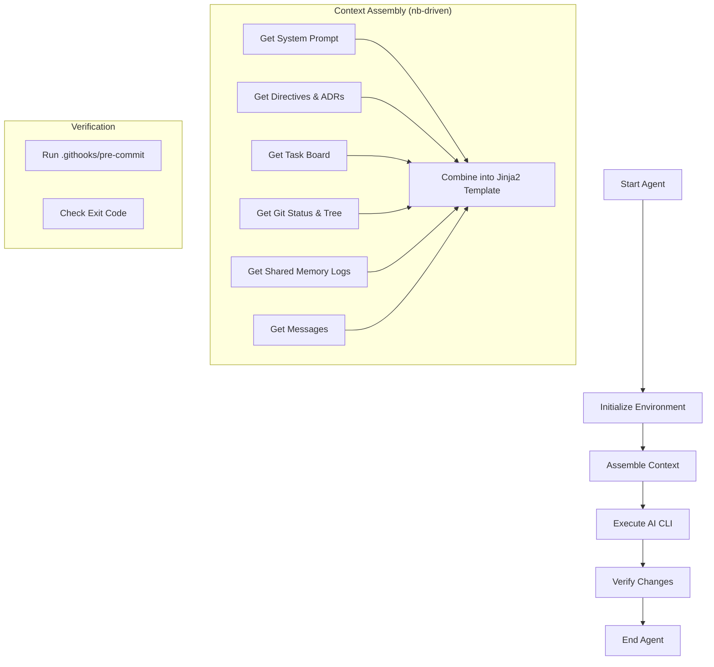
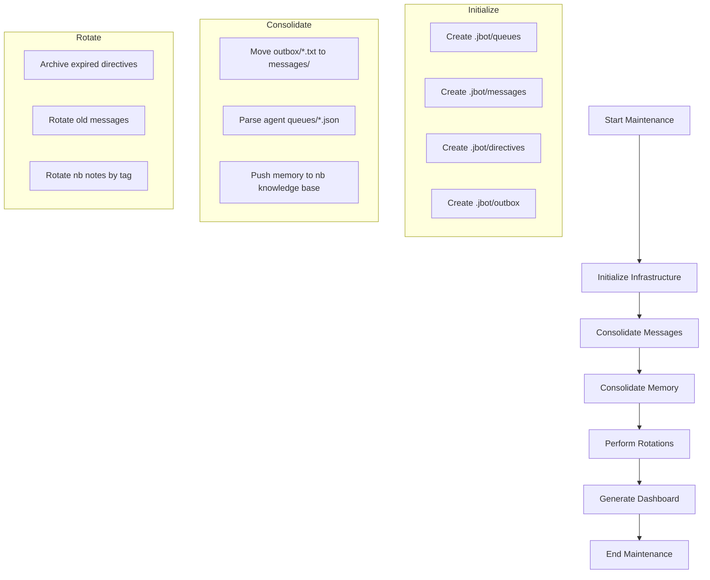

# 🌈 Nix Spirit Dashboard

*Last Updated: 2026-04-29 12:00:00*

## 🎯 Strategic Vision
> Goal: Technical Excellence & Architectural Purity.
Focus Areas:
1. Technical Purity: Prioritize elegant abstractions, code robustness, and modular design.
2. Self-Documenting Code: Mandate expressive, clear code that minimizes the need for external documentation.
3. Architectural Elegance: Ensure the Nix Spirit infrastructure is self-healing, robust, and follows the Unix Philosophy.
4. Exhaustive Verification: 100% test coverage and formal verification for core components.

## 👥 Team Roster
## 🚀 Active Tasks
- [ ] **Ensure 100% test coverage for jbot_infra.py, jbot_tasks.py, and nb_client.py** (Agent: tester)
- [ ] **Fix coverage for jbot_cli.py (missing lines 363-364, 369-370, 403-404, 412, 440)** (Agent: tester)
- [ ] **Fix coverage for jbot_infra.py (missing lines 83-85, 155-156)** (Agent: tester)
- [ ] **Fix coverage for jbot_tasks.py (missing lines 139, 249, 256, 266)** (Agent: tester)
- [ ] **Implement 'jbot init' command to fully bootstrap a new organization** (Agent: lead)

## 📜 Recent ADRs
- [[nb:109]] ADR: Branching Strategy for Stability
- [[nb:105]] ADR: Memory Interface Segregation
- [[nb:100]] ADR: Text-First Technical Memory Purity

## 💬 Recent Messages
No recent messages.

## 📊 Architectural Diagrams
### Nix Spirit Agent

### Nix Spirit Infra

## 📈 Status & Progress
- **Tasks Completed:** 20
- **Milestones Achieved:** 0

## ✅ Recent Milestones

💡 Tip: Use 'nb nix-spirit:q <query>' to search technical memory.
