# spirit Dashboard

*Last Updated: 2026-05-03 01:56:38*

## 🎯 Strategic Vision
> Error fetching vision.

## 👥 Team Roster
## 🚀 Active Tasks
No active tasks.

## 📜 Recent ADRs
No ADRs found.

## 💬 Recent Messages
No recent messages.

## 📊 Architectural Diagrams
### spirit Agent
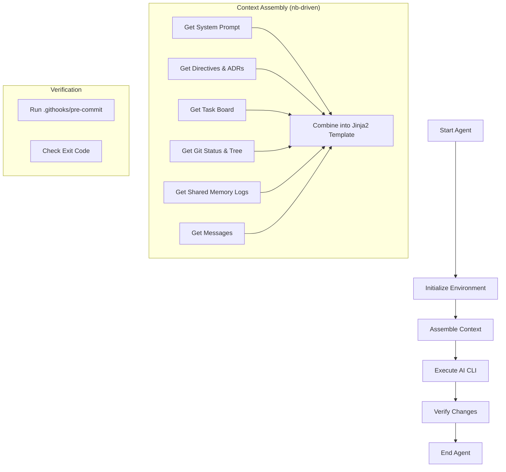

### spirit Agent Interface
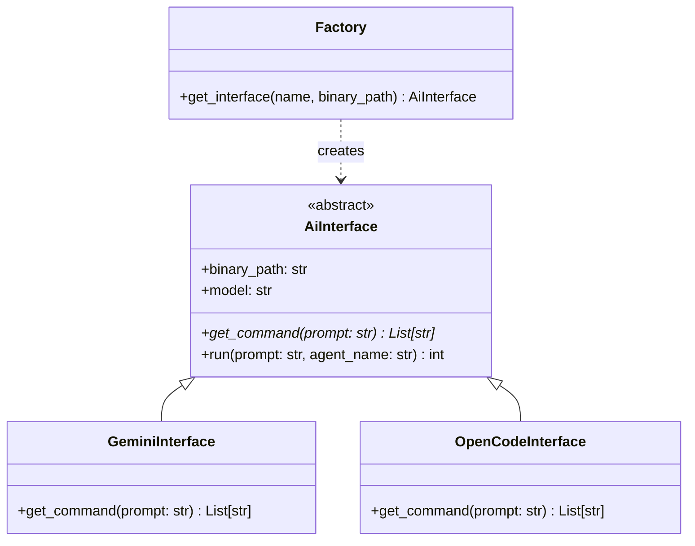

### spirit Cli
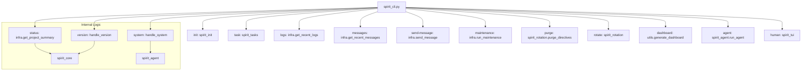

### spirit Core
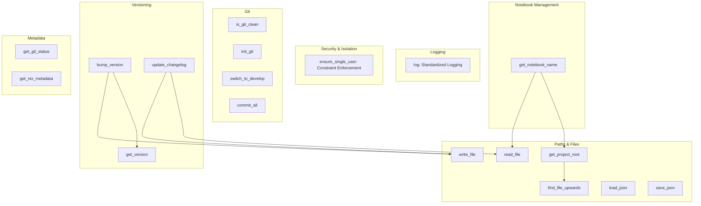

### spirit Infra
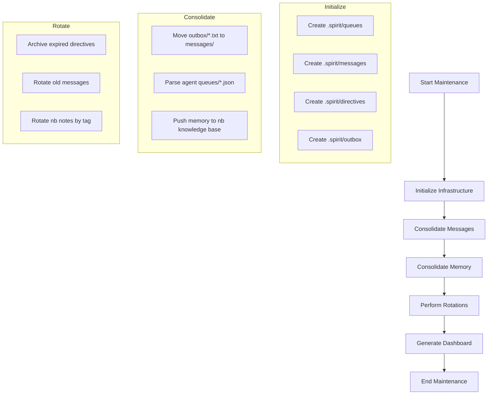

### spirit Infra Updates
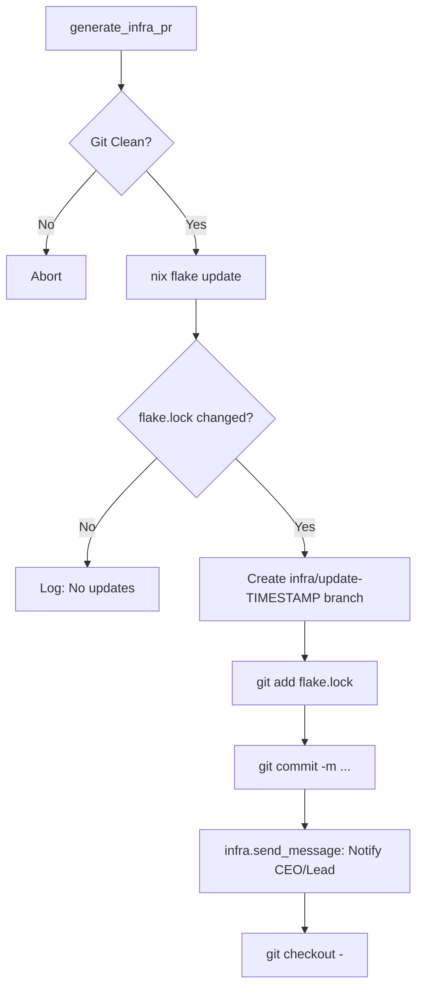

### spirit Init
```mermaid
graph TD
    INIT[init_project] --> INFRA[infra.initialize_infrastructure]
    INIT --> GIT[core.init_git]
    INIT --> BRANCH[core.switch_to_develop]
    INIT --> NB_DIR[Create .nb/]
    INIT --> NB_ADD[nb notebooks add]
    INIT --> CFG[Write .spirit/notebook]
    INIT --> GOAL[Write .project_goal]
    INIT --> AGENTS[Write .spirit/agents.json]
    INIT --> VER[Write VERSION & CHANGELOG.md]
    INIT --> IGNORE[Write .gitignore]
    INIT --> FLAKE[Write flake.nix template]
    INIT --> PROMPT[Write spirit_prompt.txt template]
    INIT --> PUSH[Push Initial Notes to nb]
    INIT --> DASH[utils.generate_dashboard]
    INIT --> COMMIT[core.commit_all]

    subgraph "Knowledge Base (nb)"
        PUSH --> GOAL_NOTE[Vision: Goal Note]
        PUSH --> TEAM_NOTE[Team Registry Note]
        PUSH --> TASK_NOTE[Initial Task Note]
    end
```

### spirit Launcher
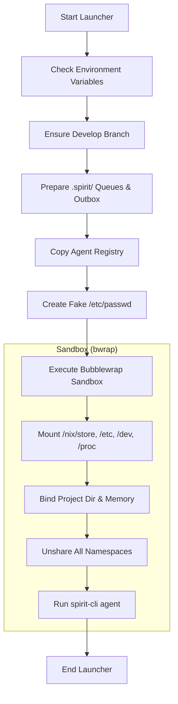

### spirit Memory Interface
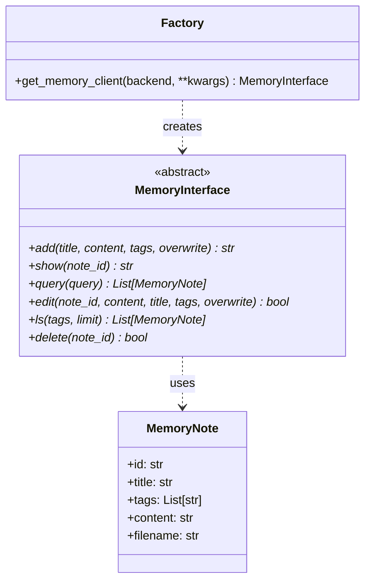

### spirit Rotation
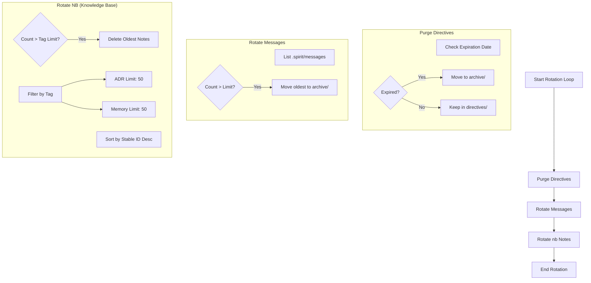

### spirit Tasks
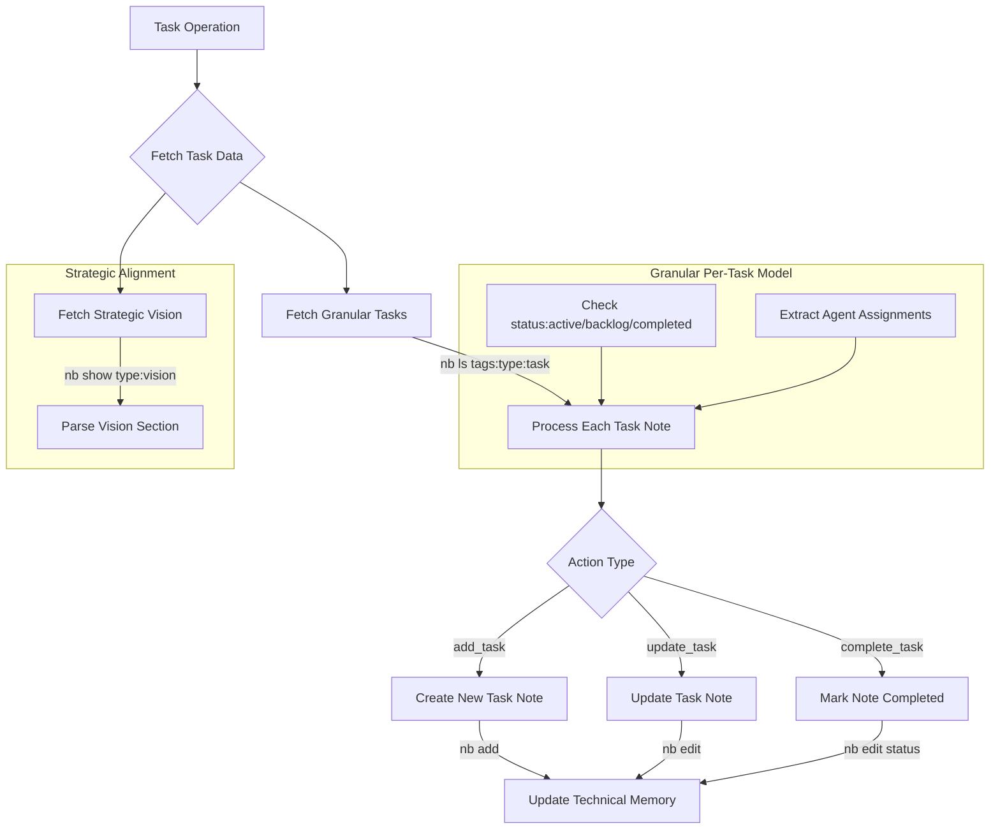

### spirit Tui
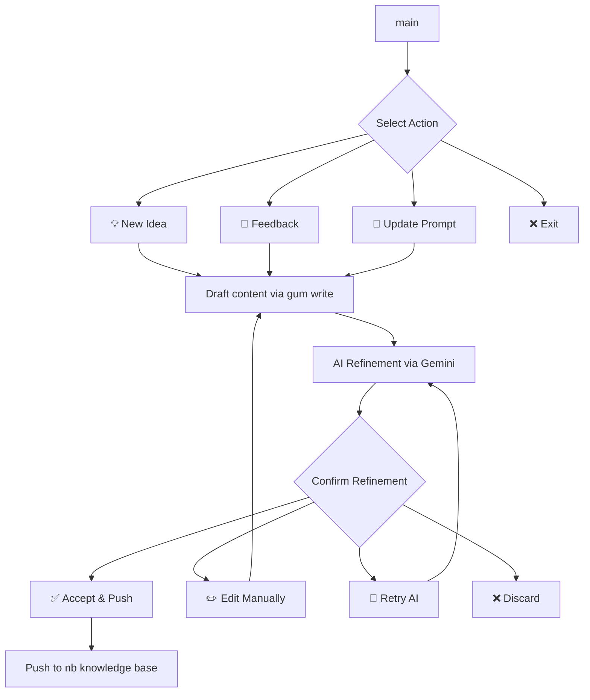

### spirit Utils
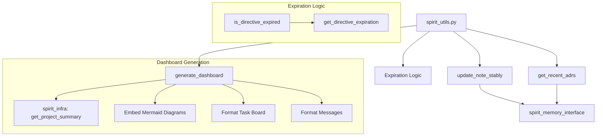

### Nb Client
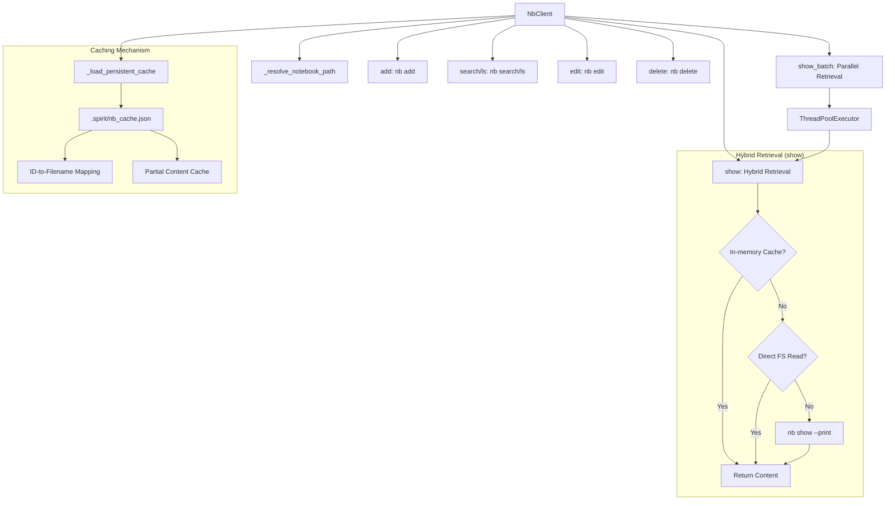

## 📈 Status & Progress
- **Tasks Completed:** 0
- **Milestones Achieved:** 0

## ✅ Recent Milestones
